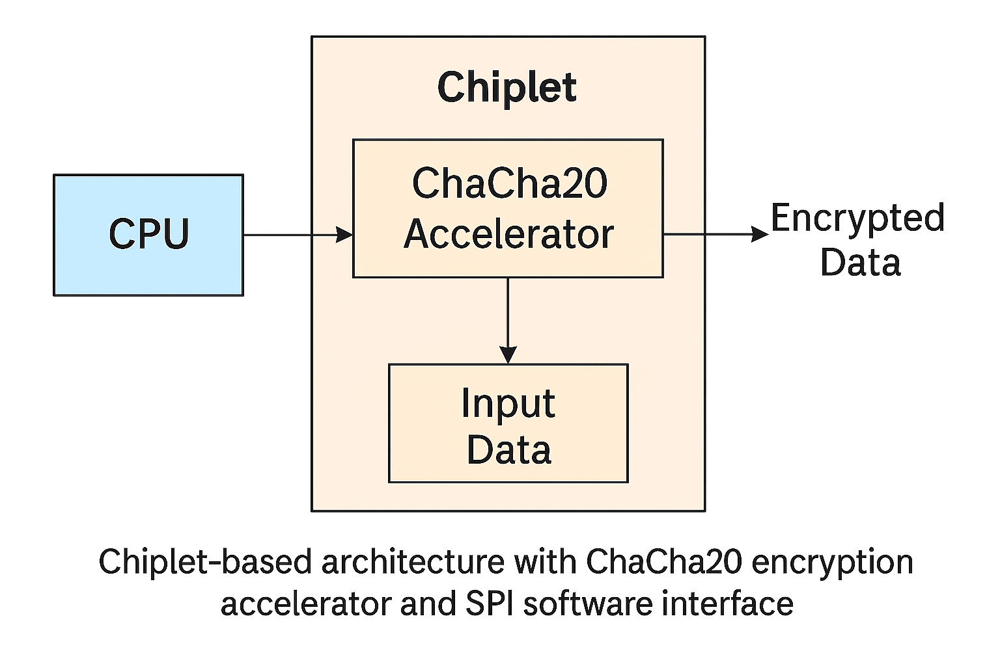

# 🔐 ChaCha20 Hardware-Software Co-Design Accelerator

  
*Figure: Chiplet-based architecture with ChaCha20 encryption accelerator and SPI software interface*

---

## 📌 Project Overview

This project implements a **hardware-accelerated ChaCha20 stream cipher** as part of a chiplet-based architecture. The design focuses on accelerating cryptographic workloads using a SystemVerilog core with a Python-based verification and software interface.

The goal is to compare and evaluate the performance of a pure Python implementation vs. a hardware-accelerated system using:

- **Hardware core:** ChaCha20 encryption engine (SystemVerilog)
- **Wrapper module:** Efficient I/O and FSM-based data movement
- **Cocotb testbench:** Full Python test automation and benchmarking
- **OpenLane:** ASIC synthesis, placement, routing, and physical design
- **Performance profiling:** CPU-only vs. HW-accelerated throughput and latency analysis

> 🧪 Benchmarked up to **2MB input size**, where hardware acceleration provides a **~5× speedup** over optimized Python implementation.

---

## ⚙️ Features

- ✅ Fully pipelined ChaCha20 encryption core
- ✅ Wrapper module for sequential 64B block processing
- ✅ Python `cocotb` testbench with dynamic input reading and timing
- ✅ OpenLane-based ASIC generation with metrics analysis
- ✅ Profiling insights from `cProfile` and quantitative performance logging

---

## 🛠️ Installation Instructions

1. **Clone the repository:**
   ```bash
   git clone https://github.com/yourusername/chacha20_hw_accelerator.git
   cd chacha20_hw_accelerator
   ```

2. **Set up Python + Cocotb environment:**
   ```bash
   python3 -m venv cocotb-env
   source cocotb-env/bin/activate
   pip install -r requirements.txt
   ```

3. **Install OpenLane** (via Docker or native build):  
   Refer to [OpenLane documentation](https://github.com/The-OpenROAD-Project/OpenLane)  
   Place `openlane` executable in your `PATH`.

---

## 🚀 Quick Start Guide

### 🔧 1. Run Software-Only Benchmark

```bash
python ChaCha20.py
```

### 🔬 2. Run Cocotb Hardware Simulation

```bash
make  # Uses Verilator + cocotb to simulate SV hardware
```

### 🧱 3. Launch OpenLane Physical Design

```bash
openlane config.json
```

After completion, view metrics under:

```
runs/RUN_*/reports/
```

---

## 📊 Performance Summary

| Mode              | 2MB Message Execution Time | Speedup |
|-------------------|----------------------------|---------|
| Pure Python       | ~52.8 seconds              | 1×      |
| HW-Accelerated    | ~10 seconds (incl. SPI)    | ~5.2×   |

Power usage, die area, and transistor counts are included in `metrics.json`. See full report in `docs/chacha20_execution_time_summary.docx`.

---

## 📚 Documentation

- `docs/chacha20_execution_time_summary.docx`: Performance metrics, power, latency
- `test_chacha20_batch.py`: Main cocotb testbench for full input processing
- `chacha20core.sv`: Core ChaCha20 encryption logic
- `chacha20_wrapper.sv`: FSM + streaming interface for 64B blocks
- `chacha20_input_manifest.json`: Test input manifest with preloaded 2MB message
- `metrics.json`: Final OpenLane summary with area, power, timing, and violations

---

## 🧩 Chiplet Architecture

The ChaCha20 accelerator is designed as a modular chiplet that communicates with the software via an SPI interface. The chiplet reads 64-byte plaintext blocks from software, encrypts them using ChaCha20 core, and returns ciphertext, all under FSM control. The design supports multi-block streaming via the wrapper module.

---

## 🤖 Use of AI in Development

This project was developed with the help of **ChatGPT (OpenAI GPT-4o)**. ChatGPT assisted in:
- Debugging and refining the SystemVerilog design
- Generating Python cocotb testbenches
- Automating OpenLane configuration and result analysis
- Documenting benchmarks and profiling results

---

## 🧠 Contributors

- **You!** (Add your name/email/GitHub here)
- PSU ECE 510 Project - Spring 2025

---

## 📄 License

MIT License – see `LICENSE.md` for full details.
